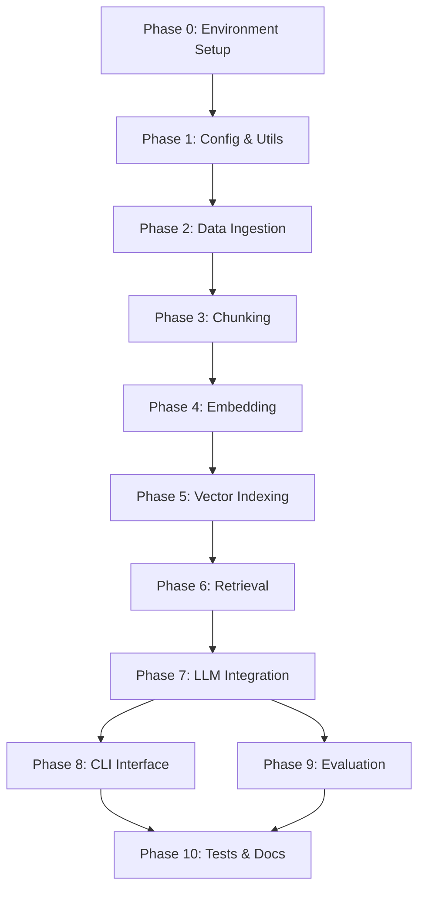

# Master Project Roadmap
## Enterprise RAG System for UNIDO Knowledge Management

> **Author:** AI Architect + Student (MSc Big Data)
> **Last Updated:** 2026-02-12
> **Hardware:** Intel i5-1235U · 8 GB RAM · Windows + WSL2 · CPU-only
> **Status Legend:** ⬜ Not Started · 🔄 In Progress · ✅ Done

---

## Executive Summary — Changes from Initial Draft

After analyzing `Project_Structure.txt` and `Technical_Requirements_RAG_System.txt` against the actual data files and the 8GB RAM constraint, the following optimizations have been applied:

### Directory Structure Changes

| Original | Optimized | Reason |
|----------|-----------|--------|
| `data/raw/finance/` | `data/raw/financial/` | Match actual folder name on disk |
| `data/raw/hr/` | `data/raw/hrm/` | Match actual folder name on disk |
| `data/raw/manufacturing/` | `data/raw/manufacture/` | Match actual folder name on disk |
| `src/embeddings/models.py` | **Removed** | Unnecessary indirection; model name lives in `settings.py` |
| `src/retrieval/reranker.py` | **Removed** | Cross-encoder reranking requires ~400 MB extra RAM — fatal on 8 GB |
| `pipeline/orchestrator.py` | **Merged into `query_pipeline.py`** | Reduces import chains and cognitive overhead |
| `notebooks/` (4 notebooks) | **Deferred to optional** | Not needed for core deliverable; can add later |
| Single `unido_kb` collection | **3 department-scoped collections** | Enables per-department retrieval without `where` filter overhead |

### Library Version Changes

| Library | Original | Optimized | Reason |
|---------|----------|-----------|--------|
| `langchain` | `0.1.20` | `langchain-community>=0.2, langchain-core>=0.2` | `0.1.x` is deprecated; the modular packages are lighter and maintained |
| `sentence-transformers` | `2.2.2` | `>=3.0.0` | 2.x loads torch eagerly; 3.x is slimmer with lazy imports |
| `chromadb` | `0.4.24` | `>=0.5.0` | 0.4.x SQLite locking bugs fixed in 0.5+ |
| `pandas` | `2.0.3` | **Removed** | Only 300 records; plain Python + regex is lighter than loading pandas (~150 MB) |
| `regex` | `2023.12.25` | **Use stdlib `re`** | Data patterns are simple enough; saves a dependency |
| — | — | `python-dotenv` | Load `.env` cleanly instead of hardcoding paths |

### Chunking Strategy Changes

| Aspect | Original | Optimized | Reason |
|--------|----------|-----------|--------|
| TXT records | 1 record = 1 chunk | 1 record = 1 chunk (kept) | Records are ~200–350 chars; already optimal |
| PDF chunk size | 512–1024 tokens | **500 characters, 100-char overlap** | Character-based is deterministic and avoids loading a tokenizer (~200 MB) |
| Embedding batch | 32 | **16** | Safer peak-RAM headroom on 8 GB |

### Embedding Model

| Aspect | Original | Optimized |
|--------|----------|-----------|
| Model | `all-MiniLM-L6-v2` | `all-MiniLM-L6-v2` **(kept)** |
| Reason | — | 384-dim, ~80 MB, excellent quality/size ratio — no change needed |

---

## Phase 0 — Environment Setup
> **Goal:** A reproducible, working dev environment on Windows + WSL2 with all dependencies installable.

### Tasks

| # | Task | Detail |
|---|------|--------|
| 0.1 | Verify Python ≥3.10 on Windows | `python --version` |
| 0.2 | Create virtual environment | `python -m venv .venv` in project root |
| 0.3 | Write `requirements.txt` | Pin versions: `langchain-community`, `langchain-core`, `chromadb`, `sentence-transformers`, `PyMuPDF`, `python-dotenv`, `pytest` |
| 0.4 | Install dependencies | `pip install -r requirements.txt` inside venv |
| 0.5 | Write `.env` | `OLLAMA_BASE_URL`, `EMBEDDING_MODEL`, `LLM_MODEL`, `CHROMA_DB_PATH`, `CHUNK_SIZE`, `CHUNK_OVERLAP` |
| 0.6 | Verify WSL2 + Ollama | `wsl -l -v`, then inside WSL: `ollama --version` |
| 0.7 | Pull quantized model | `ollama pull mistral:7b-instruct-q4_0` |
| 0.8 | Smoke-test Ollama API | `curl http://localhost:11434/api/tags` from Windows |
| 0.9 | Create project scaffold | All `__init__.py`, `src/config/settings.py`, directory tree |

### Definition of Done
- `python -c "import chromadb, sentence_transformers, fitz; print('OK')"` succeeds
- Ollama responds at `localhost:11434`
- `.venv/` exists and is listed in `.gitignore`

### ⚠️ Memory Bottleneck
- **Installing `sentence-transformers`** triggers a PyTorch download (~800 MB disk, ~300 MB RAM at import). Install *before* starting Ollama to avoid RAM contention.
- If RAM is tight during install, close VS Code and browsers first.

---

## Phase 1 — Configuration & Utilities
> **Goal:** A centralized configuration module and logging so every subsequent module reads from one source of truth.

### Tasks

| # | Task | Detail |
|---|------|--------|
| 1.1 | `src/config/settings.py` | Dataclass-based config loaded from `.env` via `python-dotenv`; exposes `CHUNK_SIZE`, `CHUNK_OVERLAP`, `EMBEDDING_MODEL`, `LLM_MODEL`, `CHROMA_DB_PATH`, `OLLAMA_BASE_URL`, department list, per-department file paths |
| 1.2 | `src/utils/logger.py` | Python `logging` with rotating file handler + stream handler; log to `logs/rag.log` |
| 1.3 | `src/utils/helpers.py` | `timer` decorator, `memory_usage()` function using `resource` or `psutil`-free approach |

### Definition of Done
- `from src.config.settings import Settings; s = Settings(); print(s.CHUNK_SIZE)` works
- Logger writes to file and stdout

### ⚠️ Memory Bottleneck
- None for this phase. Keep it lightweight.

---

## Phase 2 — Data Ingestion & Metadata Tagging
> **Goal:** Parse all 6 source files into a uniform list of `Document` dicts with `text`, `metadata` (department, source_type, source_file, record_id or page_number).

### Tasks

| # | Task | Detail |
|---|------|--------|
| 2.1 | `src/ingestion/pdf_extractor.py` | Use `fitz` (PyMuPDF) to extract text page-by-page. Return `List[dict]` where each dict = `{text, metadata: {department, source_type: "pdf", source_file, page_number}}`. Process one PDF at a time; close file handle after each. |
| 2.2 | `src/ingestion/text_parser.py` | Pure Python + `re` (no pandas). Read file line-by-line, skip blank lines, split on `". "` delimiter, extract key-value pairs. Return `List[dict]` with `{text: serialized_natural_language, metadata: {department, source_type: "structured", source_file, record_id}}`. |
| 2.3 | `src/ingestion/serializer.py` | Convert a parsed record dict → natural-language sentence. e.g. `"Finance transaction FIN-0001 on 2024-04-24…"`. Called from within `text_parser.py`. |
| 2.4 | Integration: `pipeline/ingest_pipeline.py` (Stage 1) | Orchestrate: for each department → extract PDFs → parse TXTs → merge into single `List[dict]`. Save intermediate output to `data/processed/chunks/{dept}_raw_docs.json` for debugging. |

### Definition of Done
- Running `python -m pipeline.ingest_pipeline --stage extract` produces 3 JSON files in `data/processed/chunks/`
- Finance: 100 structured records + N PDF pages
- HR: 100 structured records + N PDF pages
- Manufacturing: 100 structured records + N PDF pages
- Every document dict has a complete `metadata` sub-dict

### ⚠️ Memory Bottleneck
- **PDF extraction:** The Manufacturing PDF is 1.7 MB — by far the largest. PyMuPDF streams page-by-page, so peak RAM is ~5 MB per page. Safe.
- **Failure Mode (Naive Approach):** If you loaded all 3 PDFs into memory simultaneously using a non-streaming library (e.g., `pdfplumber`), peak RAM could spike to ~100 MB. Not catastrophic here, but the sequential-per-page habit is critical for larger corpora.

---

## Phase 3 — Chunking
> **Goal:** Split long PDF page texts into retrievable chunks while keeping structured records intact (1 record = 1 chunk).

### Tasks

| # | Task | Detail |
|---|------|--------|
| 3.1 | `src/ingestion/chunker.py` | Use `langchain.text_splitter.RecursiveCharacterTextSplitter` with `chunk_size=500`, `chunk_overlap=100`, `separators=["\n\n", "\n", ". ", " "]`. Only PDF-sourced documents get split; structured records pass through unchanged. |
| 3.2 | Metadata propagation | Each child chunk inherits the parent's metadata + adds `chunk_index` field |
| 3.3 | Integration: `pipeline/ingest_pipeline.py` (Stage 2) | Read raw docs → chunk → save to `data/processed/chunks/{dept}_chunks.json` |

### Definition of Done
- All chunks are ≤ 500 characters (with tolerance for word boundaries)
- No structured record was split — verify by asserting `source_type == "structured"` → `chunk_index == 0`
- Total chunk count logged (expected: ~350–500 total across all departments)

### ⚠️ Memory Bottleneck
- Chunking itself is trivial on 300 records + ~50 PDF pages. No risk.
- **Failure Mode:** Using token-based chunk sizes (e.g., `tiktoken`) forces loading a tokenizer model (~50 MB). Character-based splitting avoids this entirely and is deterministic.

---

## Phase 4 — Embedding Generation
> **Goal:** Convert all text chunks into 384-dimensional dense vectors using `all-MiniLM-L6-v2`.

### Tasks

| # | Task | Detail |
|---|------|--------|
| 4.1 | `src/embeddings/generator.py` | Load `SentenceTransformer('all-MiniLM-L6-v2')` once. Provide `encode_batch(texts, batch_size=16)` method that processes in batches and calls `gc.collect()` between batches. |
| 4.2 | Integration: `pipeline/ingest_pipeline.py` (Stage 3) | For each department: load chunks JSON → encode → pair embeddings with chunk IDs → pass to vectorstore |

### Definition of Done
- Each chunk has a corresponding 384-dim float32 vector
- Peak RAM during encoding stays under 1.2 GB (embedding model ~80 MB + batch of 16 chunks ≈ negligible)
- Logged: total encoding time, chunks/second, peak memory

### ⚠️ Memory Bottleneck
- **Loading `SentenceTransformer`:** ~350 MB RAM (model weights + PyTorch runtime). This is the single largest Python-side allocation.
- **Batch size = 16 vs 32:** At batch=32, the intermediate tensor allocations spike ~50 MB higher. On 8 GB, those 50 MB matter.
- **Failure Mode:** Loading the model per-department (3 times) triples loading cost. Always load once and reuse.
- **Failure Mode:** Using `all-mpnet-base-v2` (768-dim) doubles both RAM for model weights (~400 MB) and storage per vector. Not worth the marginal accuracy gain.

---

## Phase 5 — Vector Indexing (ChromaDB)
> **Goal:** Persist all embeddings + metadata into ChromaDB collections on disk.

### Tasks

| # | Task | Detail |
|---|------|--------|
| 5.1 | `src/vectorstore/chroma_manager.py` | Initialize `chromadb.PersistentClient(path=settings.CHROMA_DB_PATH)`. Create/get 3 collections: `finance_kb`, `hr_kb`, `manufacturing_kb`. Provide `add_documents(collection_name, ids, embeddings, texts, metadatas)` and `query(collection_name, query_embedding, n_results, where_filter)`. |
| 5.2 | `src/vectorstore/indexer.py` | Batch-upsert chunks into ChromaDB in groups of 50 (ChromaDB performs best with batch inserts). |
| 5.3 | Integration: `pipeline/ingest_pipeline.py` (Stage 4) | Complete pipeline: extract → chunk → embed → index. Single entrypoint: `python -m pipeline.ingest_pipeline` |

### Definition of Done
- `data/vector_db/chroma_db/` contains the SQLite file
- `client.get_collection("finance_kb").count()` returns expected chunk count
- Re-running ingestion is idempotent (upsert, not duplicate)

### ⚠️ Memory Bottleneck
- **ChromaDB PersistentClient:** ~200 MB resident RAM for SQLite + index structures. This is fine.
- **Failure Mode:** Using `chromadb.Client()` (default in-memory mode) would load ALL vectors into RAM. With 500 chunks × 384 dims × 4 bytes = ~750 KB for vectors alone (small), but the metadata index adds ~50 MB. Still fits, but loses persistence across sessions — every restart requires re-indexing.
- **Why 3 collections instead of 1:** A single `unido_kb` collection with `where={"department": "HR"}` filters at query time forces ChromaDB to scan the entire index and post-filter. Separate collections let ChromaDB use the native HNSW index per-department, making retrieval O(log n) instead of O(n) filtered.

---

## Phase 6 — Retrieval Logic
> **Goal:** Given a user query, embed it, retrieve the top-k most relevant chunks from the correct department(s), and return them with metadata.

### Tasks

| # | Task | Detail |
|---|------|--------|
| 6.1 | `src/retrieval/query_processor.py` | Embed the user query using the same `SentenceTransformer` model. Detect target department via keyword matching (e.g., "employee" → HR, "budget" → Finance, "production" → Manufacturing). If ambiguous, query all 3 collections and merge results. |
| 6.2 | `src/retrieval/retriever.py` | Call `chroma_manager.query()` with `n_results=5`. Return list of `{text, metadata, distance}` dicts sorted by relevance. Support optional `where` filter on metadata fields. |
| 6.3 | Multi-department retrieval | If department is ambiguous: query all 3 collections with `n_results=3` each → merge → sort by distance → return top 5. |

### Definition of Done
- Query "What is the HR grade structure?" returns HR-department chunks
- Query "Show me finance transactions under audit" returns Finance chunks
- Query "manufacturing growth rate in Europe" returns Manufacturing chunks
- Cross-department query "Compare HR and Finance policies" returns mixed results
- Response time < 2 seconds (embedding + retrieval, excluding LLM)

### ⚠️ Memory Bottleneck
- No additional model loading — reuses the already-loaded `SentenceTransformer`.
- **Failure Mode:** Running a cross-encoder reranker (e.g., `ms-marco-MiniLM-L-6-v2`) would add ~250 MB RAM. On 8 GB with Ollama already running, this leaves zero headroom. Skipped intentionally.

---

## Phase 7 — LLM Integration & Response Generation
> **Goal:** Send retrieved context + user query to Ollama's Mistral 7B and return a grounded, cited answer.

### Tasks

| # | Task | Detail |
|---|------|--------|
| 7.1 | `src/generation/llm_client.py` | HTTP client to Ollama REST API (`POST /api/generate`). Parameters: `model`, `prompt`, `stream=False`, `options: {temperature: 0.1, num_predict: 512, num_ctx: 2048}`. Handle timeouts (Mistral 7B on CPU can take 30–60s). |
| 7.2 | `src/generation/prompt_builder.py` | Template: system instruction + retrieved context + user question. Enforce grounding: *"Answer ONLY based on the provided context. If the context does not contain the answer, say 'I don't have enough information.'"* |
| 7.3 | `src/generation/response_handler.py` | Parse Ollama JSON response. Extract `response` field. Append source citations from chunk metadata. |
| 7.4 | Integration: `pipeline/query_pipeline.py` | Full RAG pipeline: query → embed → retrieve → build prompt → generate → format response. Single entrypoint: `python -m pipeline.query_pipeline "What is the HR promotion policy?"` |

### Definition of Done
- End-to-end query returns a natural language answer with source citations
- Response is grounded (no hallucination on test queries)
- Handles Ollama being offline gracefully (error message, not crash)
- Latency logged: retrieval time vs generation time

### ⚠️ Memory Bottleneck — **THIS IS THE CRITICAL PHASE**
- **RAM during inference:** Ollama Mistral 7B Q4_0 ≈ 4.0 GB + Python ≈ 1.5 GB + Windows ≈ 2.5 GB = **8.0 GB**
- **Mitigation:** Set `OLLAMA_NUM_PARALLEL=1`, `OLLAMA_MAX_LOADED_MODELS=1`.
- **Context window:** `num_ctx=2048` uses ~200 MB of Ollama's allocation. Increasing to 4096 would add ~400 MB — avoid unless necessary.
- **Failure Mode:** Setting `num_ctx=4096` or `num_predict=1024` without closing background apps will trigger Windows page file swapping, slowing inference from 30s to 3+ minutes.
- **Failure Mode:** Streaming responses (`stream=True`) doesn't save RAM but avoids HTTP timeout. Use `stream=False` for simplicity but set `timeout=120`.

---

## Phase 8 — CLI Query Interface
> **Goal:** A user-friendly command-line interface for querying the system.

### Tasks

| # | Task | Detail |
|---|------|--------|
| 8.1 | `scripts/run_query.py` | Interactive REPL: `while True: query = input("Ask: ")` → call `query_pipeline` → print answer with sources. Commands: `/quit`, `/department hr`, `/clear`. |
| 8.2 | `scripts/run_ingestion.py` | CLI wrapper: `python scripts/run_ingestion.py --departments finance hr manufacturing` |

### Definition of Done
- Interactive Q&A session works end-to-end
- User can force a department scope with `/department <name>`
- Graceful error handling for Ollama timeouts

### ⚠️ Memory Bottleneck
- None new. This is a thin wrapper around Phase 7.

---

## Phase 9 — Evaluation
> **Goal:** Quantitatively measure retrieval and generation quality across all 3 departments.

### Tasks

| # | Task | Detail |
|---|------|--------|
| 9.1 | `evaluation/test_queries.json` | 15 test queries (5 per department) with expected ground-truth answers sourced from the PDFs and text records |
| 9.2 | `evaluation/metrics.py` | Implement 3 metrics: **Context Relevance** (are retrieved chunks from the correct department and topic?), **Answer Accuracy** (does the answer match the ground truth?), **Faithfulness** (is the answer grounded in retrieved context, no hallucination?) |
| 9.3 | `evaluation/evaluate.py` | Run all test queries through the pipeline, compute metrics, output a markdown table to `docs/evaluation_results.md` |

### Definition of Done
- 15 queries evaluated
- Each metric scored 0.0–1.0
- Results table saved in `docs/evaluation_results.md`

### ⚠️ Memory Bottleneck
- Running 15 queries sequentially with Mistral 7B takes ~15 minutes on CPU. Run overnight or during breaks.
- **Failure Mode:** Running all 15 queries in parallel would OOM immediately (each Ollama request holds the model in RAM).

---

## Phase 10 — Testing & Documentation
> **Goal:** Unit tests for core modules and project documentation for the thesis.

### Tasks

| # | Task | Detail |
|---|------|--------|
| 10.1 | Unit tests | `tests/test_text_parsing.py`, `tests/test_chunking.py`, `tests/test_embeddings.py`, `tests/test_vectorstore.py`, `tests/test_retrieval.py` |
| 10.2 | Integration test | `tests/test_end_to_end.py` — mock Ollama to avoid LLM dependency in CI |
| 10.3 | `docs/architecture.md` | System architecture diagram (Mermaid), component interactions |
| 10.4 | `docs/setup_guide.md` | Step-by-step installation (Windows + WSL2 + Ollama) |
| 10.5 | `docs/usage_guide.md` | How to run ingestion, query, and evaluation |
| 10.6 | `README.md` | Project overview, quick start, architecture summary |

### Definition of Done
- `pytest tests/` passes with ≥80% coverage on `src/`
- All docs are written and linked from README

### ⚠️ Memory Bottleneck
- Use `pytest-timeout` to prevent hung tests that hold the embedding model in RAM.

---

## Optimized Project Structure (Final)

```
enterprise-rag-ekm/
├── data/
│   ├── raw/                              # Original source documents (never modified)
│   │   ├── financial/
│   │   │   ├── Finance_and_Accounting.txt
│   │   │   └── UNIDO Finance.pdf
│   │   ├── hrm/
│   │   │   ├── Human_Resource_Management.txt
│   │   │   └── UNIDO HR.pdf
│   │   └── manufacture/
│   │       ├── Manufacturing_and_Production.txt
│   │       └── UNIDO Manufacturing.pdf
│   ├── processed/
│   │   └── chunks/                       # Intermediate JSON outputs per department
│   └── vector_db/
│       └── chroma_db/                    # ChromaDB persistent SQLite storage
│
├── src/
│   ├── config/
│   │   ├── __init__.py
│   │   └── settings.py                   # Dataclass config loaded from .env
│   ├── ingestion/
│   │   ├── __init__.py
│   │   ├── pdf_extractor.py              # PyMuPDF page-by-page extraction
│   │   ├── text_parser.py                # Pure Python + re (no pandas)
│   │   ├── chunker.py                    # RecursiveCharacterTextSplitter
│   │   └── serializer.py                 # Record dict → natural language
│   ├── embeddings/
│   │   ├── __init__.py
│   │   └── generator.py                  # SentenceTransformer encode with batching
│   ├── vectorstore/
│   │   ├── __init__.py
│   │   ├── chroma_manager.py             # ChromaDB PersistentClient wrapper
│   │   └── indexer.py                    # Batch upsert into collections
│   ├── retrieval/
│   │   ├── __init__.py
│   │   ├── query_processor.py            # Query embedding + department detection
│   │   └── retriever.py                  # Similarity search + multi-dept merge
│   ├── generation/
│   │   ├── __init__.py
│   │   ├── llm_client.py                 # Ollama REST API client
│   │   ├── prompt_builder.py             # RAG prompt template
│   │   └── response_handler.py           # Response parsing + citations
│   └── utils/
│       ├── __init__.py
│       ├── logger.py                     # Rotating file + stream logger
│       └── helpers.py                    # Timer decorator, memory helpers
│
├── pipeline/
│   ├── __init__.py
│   ├── ingest_pipeline.py                # Extract → Chunk → Embed → Index
│   └── query_pipeline.py                 # Query → Retrieve → Generate → Respond
│
├── tests/
│   ├── __init__.py
│   ├── test_text_parsing.py
│   ├── test_chunking.py
│   ├── test_embeddings.py
│   ├── test_vectorstore.py
│   ├── test_retrieval.py
│   └── test_end_to_end.py
│
├── evaluation/
│   ├── __init__.py
│   ├── metrics.py
│   ├── test_queries.json
│   └── evaluate.py
│
├── scripts/
│   ├── run_ingestion.py
│   └── run_query.py                      # Interactive CLI REPL
│
├── docs/
│   ├── ROADMAP.md                        # ← This file
│   ├── architecture.md
│   ├── setup_guide.md
│   ├── usage_guide.md
│   └── evaluation_results.md
│
├── requirements.txt
├── .env
├── .env.example
├── .gitignore
└── README.md
```

---

## RAM Budget Summary (Peak Usage Per Phase)

| Phase | Component | RAM |
|-------|-----------|-----|
| 0–3 | Python + PyMuPDF + chunking | ~500 MB |
| 4 | + SentenceTransformer loaded | ~850 MB |
| 5 | + ChromaDB persistent writes | ~1.1 GB |
| 6 | Retrieval (same as 5) | ~1.1 GB |
| 7 | + Ollama Mistral 7B Q4_0 | **~5.1 GB Python + ~4 GB Ollama = overlaps with Windows** |
| — | **Windows + everything** | **~8 GB (swap likely for brief spikes)** |

> [!CAUTION]
> **Phase 7 is the tightest.** During LLM inference, close all browsers and non-essential apps. Ensure ≥10 GB free disk space for Windows page file (swap).

---

## Implementation Order & Dependencies



---

## Next Steps

Once you approve this roadmap, we proceed **Phase 0 → Phase 1 → …** one task at a time. For every engineering decision, I will explain:

1. **Why this approach** (rationale)
2. **Failure Mode** (what breaks if we chose naively)
3. **Memory impact** (estimated RAM delta)

**Ready when you are.** ✅
